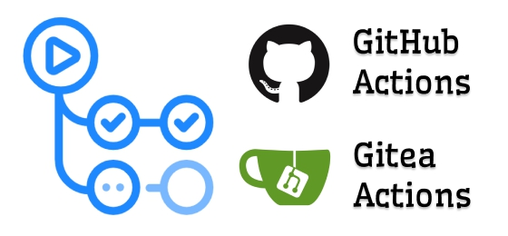

<p align="center">
    
</p>

# Building a composer package in GitHub Action

[](https://github.com/rosven9856/composer-package-action/blob/master/LICENSE)
[](https://github.com/rosven9856/composer-package-action/actions/workflows/tests.yml)

With this GitHub Action, you can build a package for the PHP Composer package manager.


## Example usage

```yaml
    steps:
      - uses: actions/checkout@v4
      - uses: rosven9856/composer-package-action@0.1.4
        id: composer_package
        with:
          directory: ''
          file: ''
      - run: echo ${{ steps.composer_package.outputs.file_path }}
      - run: echo ${{ steps.composer_package.outputs.directory_path }}
```

### Inputs

#### `directory`
The name of the directory for package building   
Default value: *.build*

#### `file`
The name of the built package file  
Default value: *package.zip*

### Outputs

#### `directory_path`
The path to the building directory

#### `file_path`
The path to the compiled package archive


## Developing

build
```shell
docker build . --build-arg=PHP_VERSION=8.3.10-1 -t=composer-package-action
```

initialization
```shell
docker run --rm -e GITHUB_WORKSPACE=/usr/bin/app -v .:/usr/bin/app composer-package-action composer install
```

running
```shell
docker run --rm -e GITHUB_WORKSPACE=/usr/bin/app -v .:/usr/bin/app composer-package-action php app.php
```

